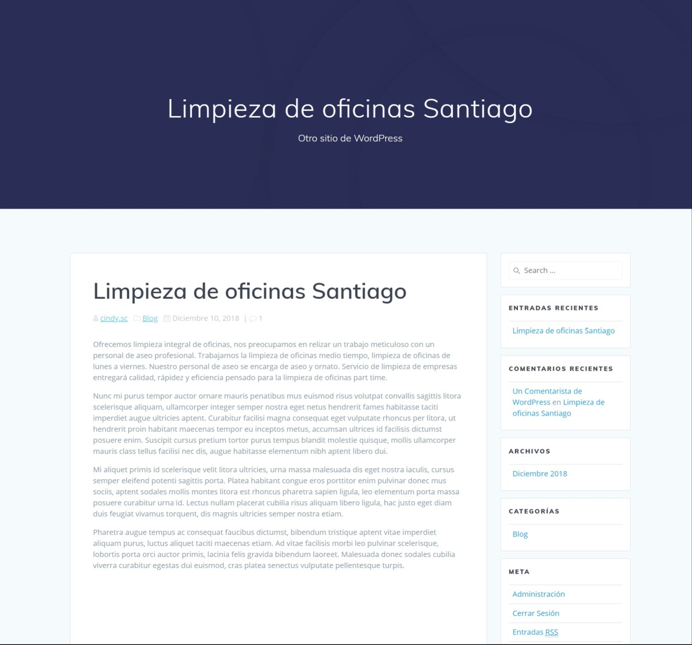

# Ejercicio_18
Deploy, SEO, y seguridad - Wordpress

**Información empresa:**
- Empresa: Kleaner S.A.
- Dirección: Florinda Mesa 67, Quinta Normal, Santiago
- Rubro: Aseo de oficinas
- Clientes: Medianas y grandes empresas que no quieren contratar personal de aseo.
- Qué hace diferente a su empresa: Nuestro servicio integral basado en la confianza y rapidez
- Palabras usadas en su rubro: Aseo, limpieza de oficinas, servicio de limpieza, servicio externo de limpieza, limpieza de oficinas Santiago

## Keywords
- limpieza integral de oficinas
- limpieza de oficinas medio tiempo
- limpieza de oficinas de lunes a viernes
- limpieza de oficinas medio tiempo
- servicio de limpieza empresas
- empresa aseo
- personal de aseo
- personal aseo profesional
- funciones del personal de aseo
- aseo y ornato
- limpieza de oficinas part time
- aseo

###Descripción
Se tomaron las palabras usadas en el rubro para ver su posicionamiento, se seleccionaron las que tenían equivalencia entre volumen de búsqueda y competencia para lograr posicionar la empresa.
Por medio de una tabla se clasifican las palabras según estas especificaciones y posteriormente incluirlas en el sitio.

####Inicio

#####Entrada

